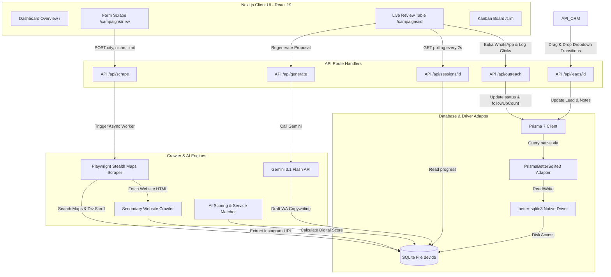

# Dokumentasi Teknis & Alur Penggunaan: ClientSearcher

Selamat! Seluruh sistem **ClientSearcher - Lead Generation & WhatsApp Outreach Automation** telah berhasil diimplementasikan, dikonfigurasi secara optimal dengan spesifikasi terbaru **Prisma 7 (Driver Adapter)**, dan berhasil dikompilasi 100% tanpa error (`Exit Code: 0`). 

Dokumen ini menjelaskan secara mendalam arsitektur teknis (*Technology Stack*) yang digunakan serta alur penggunaan sistem (*User Workflow*) secara menyeluruh dari proses scraping Google Maps hingga closing klien di CRM.

---

## 🛠️ 1. Detail Mendalam Technology Stack & Arsitektur

Sistem dirancang dengan arsitektur modern berkecepatan tinggi yang memisahkan tugas berat di latar belakang (*background headless crawling*) dengan antarmuka dinamis (*real-time dashboard UI*) yang sangat interaktif.



### A. Core Web Framework: Next.js 16 (React 19)
* **App Router Architecture**: Kami memanfaatkan struktur App Router terbaru. Semua file rute halaman diatur di dalam direktori `app/`, mengoptimalkan pemisahan Server Components dan Client Components (`'use client'`).
* **Direct Server Querying**: Pada halaman utama dashboard (`/`), daftar kampanye (`/campaigns`), dan halaman CRM (`/crm`), kami menggunakan **Next.js Server Components** untuk melakukan kueri database secara langsung melalui Prisma pada saat halaman dirender di server. Hal ini meniadakan latensi request HTTP client-side tambahan, mempercepat waktu render awal (*Initial Page Load*), dan ramah terhadap SEO.
* **Turbopack Bundler**: Sistem dikompilasi menggunakan compiler Turbopack Next.js berkinerja tinggi berbasis Rust yang menawarkan *hot module reloading* instan dalam hitungan milidetik.

### B. Styling & Design System: Tailwind CSS v4
* **Deep Space Aesthetics**: Antarmuka dipoles menggunakan Tailwind CSS v4 dengan mode gelap bawaan (*dark mode by default*). Palet warna mengandalkan warna latar belakang angkasa gelap (`#080710`), aksen neon indigo/violet kustom, serta batas-batas transparan halus untuk efek **Glassmorphism**.
* **Inline Theme configuration**: Token desain kustom (seperti `color-card-bg`, `color-primary-color`, `glass-panel-glow`) diintegrasikan secara elegan di dalam berkas [globals.css](file:///d:/Work/Client-Searcher/app/globals.css) menggunakan direktif `@theme inline` baru dari Tailwind CSS v4.
* **Micro-Animations**: Kami menyertakan transisi halus pada status hover kartu, animasi berdenyut (*pulsating glow*) untuk tombol Gemini AI, animasi pemuatan kustom (*shimmer loading effect*), dan animasi berputar (*loader spin*) untuk antarmuka yang sangat responsif dan terasa hidup.

### C. Database Engine: Prisma 7 & Driver Adapter SQLite
Prisma 7 membawa perubahan besar di mana runtime query engine internal (binary) telah sepenuhnya dipisahkan dari inti library demi mendukung performa optimal di lingkungan edge. Oleh karena itu, koneksi SQLite dikonfigurasi menggunakan arsitektur **Driver Adapter**:
1. **better-sqlite3**: Driver native Node.js tercepat untuk SQLite di Windows/Linux yang mengeksekusi kueri langsung ke memori / disk tanpa overhead protokol jaringan.
2. **@prisma/adapter-better-sqlite3**: Adapter resmi Prisma 7 yang menjembatani struktur query AST Prisma dengan pustaka `better-sqlite3`.
3. **Pemisahan Konfigurasi**:
   * File [schema.prisma](file:///d:/Work/Client-Searcher/prisma/schema.prisma) hanya mendefinisikan database provider sebagai `sqlite`. Ia tidak memiliki properti `url` statis (karena Prisma 7 melarangnya dalam berkas schema guna meningkatkan modularitas).
   * File [prisma.config.ts](file:///d:/Work/Client-Searcher/prisma.config.ts) di root folder bertugas memuat berkas konfigurasi `.env` dan menyuplai parameter `url: process.env["DATABASE_URL"]` (berisi `"file:./dev.db"`) untuk kebutuhan migrasi CLI (`npx prisma db push`).
   * File instansiasi [prisma.ts](file:///d:/Work/Client-Searcher/lib/db/prisma.ts) membaca berkas database `dev.db` secara dinamis, menginisialisasi instansi `Database` dan `PrismaBetterSqlite3`, lalu meneruskannya sebagai objek `{ adapter }` ke konstruktor `new PrismaClient()`.

### D. Scraper & Crawler Engine: Playwright Stealth
Modul penemu prospek terletak di `/lib/scraper/` dan dikoordinasikan secara asinkronus:
* **stealth.ts**: Mengintegrasikan konfigurasi anti-bot tingkat lanjut. Ia melakukan rotasi acak User-Agent modern, menyuntikkan evasive headers untuk menyembunyikan flag otomatisasi (seperti `navigator.webdriver`), mengontrol sidik jari browser (WebRTC, plugin palsu), serta menerapkan waktu jeda acak manusiawi (*humanized delay* berkisar 1.5 - 3 detik) di setiap interaksi klik atau gulir halaman.
* **extractor.ts**: Pustaka ekstraktor DOM Google Maps yang stabil. Ia membaca elemen teks nama bisnis, alamat, rating bintang, jumlah ulasan, kategori industri, nomor telepon, dan URL website resmi.
* **Secondary Website Crawler (HTML Instagram Extractor)**: Jika suatu bisnis memiliki website resmi, crawler akan memicu request HTTP GET latar belakang secara asinkronus untuk mengunduh source code HTML website tersebut. Menggunakan pencarian ekspresi reguler (Regex) berkinerja tinggi, crawler mencari pola link media sosial Instagram (`instagram.com/username`) dan menyimpannya ke database sebagai saluran alternatif outreach jika nomor telepon mereka tidak terdaftar.
* **playwright.ts**: Pengendali browser utama. Ia membuka halaman Google Maps dengan query kustom (misal: "restoran di surabaya"), mencari container panel gulir daftar maps (`div[role="feed"]`), menggulir ke bawah secara rekursif hingga mencapai batas leads limit, mengklik detail bisnis satu per satu secara berurutan, lalu memicu proses scoring & AI proposal copywriting secara paralel di latar belakang.

### E. AI Proposal Engine: Gemini 3.1 Flash API
Sistem copywriting diatur di `/lib/ai/` menggunakan model terbaru dari Google:
* **Gemini 3.1 Flash (gemini-1.5-flash / gemini-2.0-flash)**: Model AI berkecepatan tinggi dengan kuota *free tier* melimpah dan mendukung keluaran data terstruktur JSON secara native (`responseMimeType: "application/json"`).
* **JSON Structured Prompting**: Prompt AI diatur ketat di [prompts.ts](file:///d:/Work/Client-Searcher/lib/ai/prompts.ts). AI dipaksa memberikan output berformat JSON berisi teks outreach WhatsApp bersahabat dalam Bahasa Indonesia dan ulasan audit singkat 1-2 kalimat mengenai kehadiran digital prospek.
* **Contextual Copywriting**: Prompt menyuplai detail digital audit lead secara mendalam (misal: nama bisnis, kategori, kota, rating, apakah tidak punya website, apakah email mereka masih menggunakan Gmail gratisan, dan layanan IT apa yang disarankan). Gemini memformulasikan pesan yang sangat personal:
  1. *Apresiasi*: Memuji bisnis prospek (menyebutkan rating/ulasan positif mereka di Maps).
  2. *Empati*: Menyoroti pentingnya presence digital di kota target mereka saat ini.
  3. *Problem Solving*: Menyebutkan secara halus celah digital mereka (misal: "saya menyadari Klinik Kecantikan Ibu saat ini belum memiliki landing page resmi untuk sistem booking jadwal tindakan...").
  4. *Penawaran*: Menawarkan solusi pembuatan web booking/menu QR otomatis yang relevan dengan bisnis mereka dengan ajakan diskusi santai via WA (*Call to Action*).
* **Robust Fallback Generator**: Jika berkas `.env` tidak memiliki API key Gemini, sistem otomatis memicu modul fallback di [proposal.ts](file:///d:/Work/Client-Searcher/lib/ai/proposal.ts) untuk menghasilkan teks draf kustom lokal berkualitas tinggi, mencegah crash dan menjaga agar demo aplikasi tetap berjalan 100% interaktif.

---

## 🔄 2. Alur Penggunaan Sistem Secara End-to-End

Berikut adalah siklus hidup penggunaan sistem dari mulai penelusuran leads hingga deal closing:

```
[ Form Input Baru ] ──► [ Lock Check ] ──► [ Playwright Scraper ] ──► [ Web Crawl & IG Extractor ]
                                                                                │
[ Live Polling ] ◄─── [ Gemini AI Proposal ] ◄─── [ Algorithm Scoring ] ◄───────┘
       │
[ Human Audit ] ──► [ Edit Text ] ──► [ Approve ] ──► [ Buka WA Web ] ──► [ Kanban CRM Board ]
                                                                                │
                                                                       [ Deal Won / Lost ]
```

### Fase 1: Inisiasi Kampanye & Concurrency Lock
1. Pengguna membuka halaman **Scrape Campaign** dan mengklik **Mulai Pencarian Baru** (`/campaigns/new`).
2. Pengguna mengisi **Niche / Industri** target (misal: "klinik gigi"), **Kota / Lokasi** (misal: "Bandung"), dan menggeser **Limit Leads** (5 - 30 leads).
3. Saat tombol **Jalankan Pencarian Prospek** ditekan, form mengirimkan request POST ke `/api/scrape`.
4. **Pencegah Konflik (Lock Check)**: API mengecek status kampanye di database. Jika ada kampanye lain yang masih berstatus `running`, request baru akan ditolak dengan pesan peringatan: *"Scraper sedang berjalan untuk pencarian lain. Harap tunggu hingga selesai agar tidak terjadi bentrokan resource browser."*
5. Jika aman, API akan membuat baris baru di tabel `scraping_sessions` dengan status `running` dan memicu fungsi asinkronus Playwright di latar belakang. API langsung mengembalikan respons sukses instan berupa objek `{ session: { id } }` kepada klien tanpa memblokir browser user (asynchronous background execution).
6. Halaman otomatis dialihkan ke halaman detail leads review (`/campaigns/[id]`).

### Fase 2: Headless Scrape & Crawling Latar Belakang
1. Browser Chromium headless (Playwright) terbuka dan menavigasi ke Google Maps.
2. Playwright memasukkan kata kunci penelusuran secara dinamis (misal: `klinik gigi di Bandung`).
3. Sistem mendeteksi panel kiri maps dan mulai melakukan scroll ke bawah secara bertahap. Jeda acak 1.5 detik diterapkan setiap kali scroll untuk memicu lazy-loading daftar listing tanpa dicurigai sebagai bot.
4. Setelah mengumpulkan URL tempat bisnis sesuai limit (misal: 15 leads), browser akan memproses URL tersebut secara berurutan.
5. Browser mengklik detail bisnis, mengekstrak data nama, rating, ulasan, telepon, alamat, dan website resmi.
6. **Trigger Secondary Crawler**: Jika properti website terdeteksi dan merupakan website mandiri, modul web crawler asinkronus dijalankan untuk mengunduh HTML website dan memindai tag jangkar `href` yang mengarah ke Instagram guna menangkap username sosial media mereka.

### Fase 3: Scoring & AI Copywriting Otomatis
1. Setelah data bisnis dan instagram lengkap diekstrak oleh Playwright, sistem memanggil modul **AI Scorer** (`/lib/scorer/algorithm.ts`).
2. Skor dihitung secara otomatis berdasarkan 6 parameter kehadiran digital dan layanan IT yang direkomendasikan langsung ditentukan berdasarkan kategori bisnis.
3. Bisnis disimpan ke tabel `leads` database dengan status awal `scored`.
4. Sistem memanggil modul **Gemini AI Proposal** (`/lib/ai/proposal.ts`) dengan menyuplai context data bisnis yang telah diaudit.
5. Gemini menyusun teks proposal WhatsApp personal dalam Bahasa Indonesia yang membujuk dan ramah. Teks proposal ini ditulis ke dalam tabel `outreach_messages` dengan `version: 1` yang berelasi dengan data lead tersebut.
6. Kolom progress `totalFound` pada sesi kampanye di database dinaikkan sebesar `+1`.

### Fase 4: Live Polling & Human-in-the-Loop Audit
1. Selagi browser Playwright bekerja keras di latar belakang, halaman detail leads klien (`/campaigns/[id]`) mendeteksi status kampanye `running`.
2. **Real-time Sync**: Komponen klien memicu fungsi *interval polling* ke API `/api/sessions/[id]` setiap 2 detik.
3. Setiap kali database mencatat pertambahan leads baru dari proses Playwright, baris tabel detail kampanye di layar pengguna akan bertambah secara instan secara real-time tanpa perlu me-refresh halaman! Pengguna dapat memantau baris demi baris lead masuk lengkap dengan badge skor potensinya.
4. Setelah Playwright selesai memproses seluruh limit leads, status kampanye di database diubah menjadi `done`, dan halaman detail otomatis menghentikan kueri polling latar belakang.
5. **Human-in-the-Loop Review**: Pengguna mengklik salah satu baris leads untuk memperluas baris (*accordion drawer*). Panel audit visual yang canggih terbuka:
   * **Bagan Kiri (Audit)**: Pengguna meninjau rincian poin skor digital, tautan alamat/telepon/web, serta dapat menuliskan catatan operasional di kolom **Catatan Tim CRM** (kolom ini memiliki autosave trigger `onBlur` ke API `/api/leads/[id]` PATCH untuk menjaga data tetap tersimpan saat pengguna mengetik).
   * **Bagan Kanan (AI Text Review)**: Pengguna membaca pesan WhatsApp kustom yang dihasilkan AI di dalam textarea yang dapat diedit langsung.
     * Jika pesan kurang pas, pengguna dapat merevisinya secara manual.
     * Jika ingin draf baru, pengguna mengklik tombol **Regenerate** (membuat request ke `/api/generate`). Sistem memanggil Gemini AI untuk merumuskan kembali pesan yang baru, menyimpan pesan baru tersebut di DB dengan `version: 2` (riwayat versi tetap dipertahankan), dan memuat teks baru tersebut ke textarea secara instan.

### Fase 5: WhatsApp Outreach & Click Tracking
1. Setelah draf pesan WhatsApp dirasa sudah sempurna, pengguna mengklik tombol **Approve Pesan**.
2. API `/api/leads/[id]` dipanggil untuk memperbarui status lead di database dari `scored` menjadi `approved`, serta mengunci teks pesan terakhir yang disetujui.
3. Tombol **Buka WA** yang berwarna hijau cerah akan aktif.
4. Pengguna mengklik tombol **Buka WA**:
   * Sistem mengirimkan request POST latar belakang ke API `/api/outreach`.
   * API akan meningkatkan angka `followUpCount` lead sebanyak `+1`, mencatat riwayat tindakan di tabel `follow_ups` dengan status channel `whatsapp` dan aksi `contacted`, serta memperbarui status lead utama menjadi `contacted`.
   * Di saat yang sama, aplikasi membuka tab browser baru mengarah ke deep-link URL `wa.me` internasional (nomor telepon otomatis diformat ke kode negara `628xxx` dan teks proposal kustom di-encode secara aman) guna membuka aplikasi WhatsApp Web atau desktop Anda dengan teks pesan yang sudah terisi otomatis!
   * Pengguna tinggal menekan tombol "Kirim" di aplikasi WhatsApp mereka.

### Fase 6: Kanban CRM Pipeline & Deals Lifecycle
1. Pengguna membuka menu **CRM Pipeline** (`/crm`) untuk memantau kemajuan tindak lanjut dari seluruh kampanye secara kolektif.
2. Leads dari semua kampanye dikelompokkan ke dalam 5 kolom Kanban visual yang luas.
3. Saat prospek membalas pesan WhatsApp di HP Anda, pengguna dapat memperbarui kemajuan kualifikasi prospek langsung dari kartu CRM:
   * Jika prospek membalas santai, klik **Merespons** untuk memindahkannya ke kolom **Negosiasi Aktif** (status DB: `replied`).
   * Jika prospek meminta penawaran resmi, klik **Proposal** di kartu untuk mengubah statusnya menjadi `proposal_sent`.
   * Jika negosiasi sukses dan prospek setuju bekerja sama membuat website/layanan IT dengan agency Anda, klik **Won** untuk memindahkannya ke kolom **Closing Deal** (status DB: `closed_won`) dengan visual kembang api deal sukses!
   * Jika ditolak, klik **Lost** (status DB: `closed_lost`).
4. Klik pada kartu lead mana saja di papan Kanban akan memunculkan **Glassmorphic Sidebar Modal** di mana pengguna dapat membaca riwayat detail audit kehadiran digital, tautan eksternal, melacak status pipeline secara komprehensif, serta menuliskan catatan perkembangan negosiasi penjualan secara terperinci (autosave didukung).
