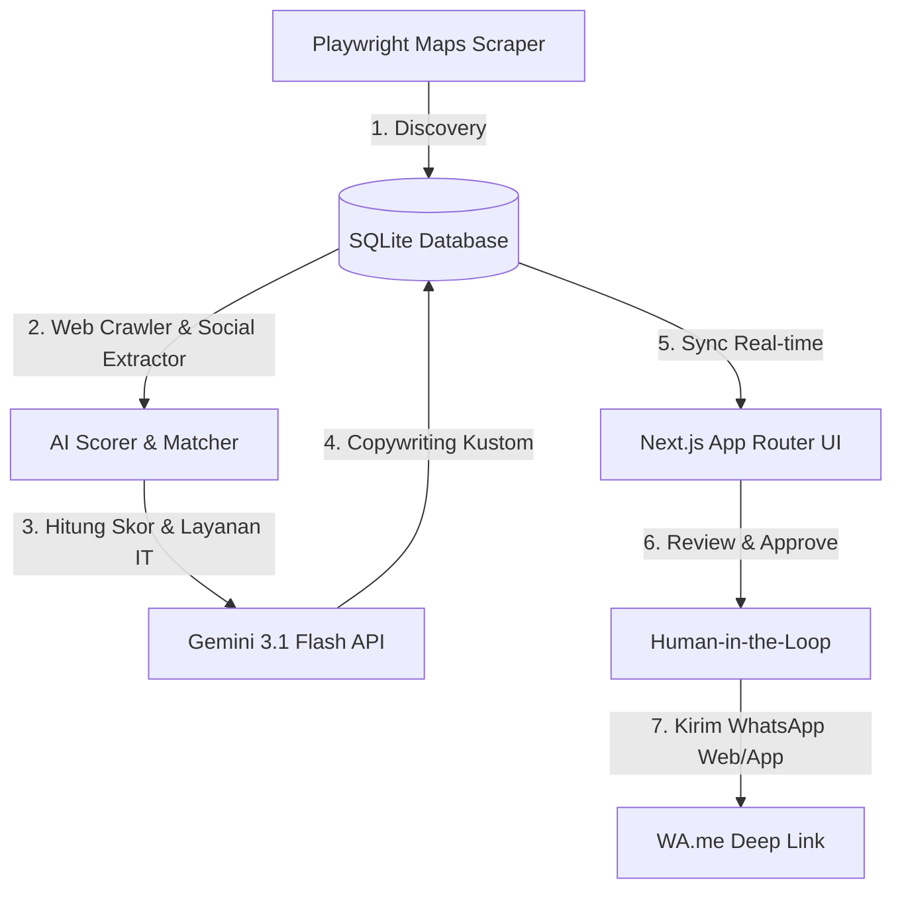

# Handover Plan: Lead Generation & Outreach Automation System

Selamat! Seluruh sistem **Lead Generation & WhatsApp Outreach Automation** telah berhasil diimplementasikan, dikonfigurasi secara optimal dengan spesifikasi terbaru **Prisma 7 (Driver Adapter)**, dan berhasil dikompilasi 100% tanpa error (`Exit Code: 0`). 

Sistem ini dirancang khusus untuk IT Agency Anda guna melakukan pencarian prospek (*discovery*) secara masif di Google Maps, menyaring (*scoring*) berdasarkan kehadiran digital mereka, menghasilkan draf penawaran WhatsApp personal dengan **Gemini 3.1 Flash**, serta melacak perkembangan *deals* secara visual melalui **CRM Kanban Pipeline**.

---

## 🛠️ Stack Teknologi & Detail Arsitektur



### 1. Database & Prisma 7 Driver Adapter
Untuk kemudahan instalasi ("zero-install"), sistem menggunakan **SQLite** (`dev.db`). Karena **Prisma 7** tidak lagi mengizinkan property `url` didefinisikan langsung dalam `schema.prisma`, arsitektur database kami buat sangat rapi dan *future-proof* menggunakan model **Driver Adapter**:
* **Konfigurasi Schema**: [schema.prisma](file:///d:/Work/Client-Searcher/prisma/schema.prisma) mendefinisikan provider `sqlite` secara murni.
* **Driver Adapter**: [prisma.ts](file:///d:/Work/Client-Searcher/lib/db/prisma.ts) mengimpor `@prisma/adapter-better-sqlite3` and `better-sqlite3` untuk menginisialisasi koneksi file lokal SQLite secara native.
* **Konfigurasi Migrasi**: [prisma.config.ts](file:///d:/Work/Client-Searcher/prisma.config.ts) mengarah ke variabel lingkungan `DATABASE_URL="file:./dev.db"`.

### 2. Playwright Scraper Engine (`/lib/scraper/`)
* **stealth.ts**: Menghindari *bot detection* menggunakan rotasi User-Agent, manipulasi evasive headers (WebRTC, webdriver bypass), dan jeda acak (*randomized human-like delays*).
* **extractor.ts**: Menarik data nama bisnis, alamat, rating, jumlah ulasan, kategori, nomor telepon, dan link website. Jika website ditemukan, crawler sekunder akan mengunduh HTML dan mengekstrak link profil Instagram bisnis tersebut.
* **playwright.ts**: Koordinator browser yang membuka Maps, menggulir (*scrolling*) panel daftar bisnis, detail secara berurutan, memicu kalkulasi skor, memicu pembuatan proposal Gemini, dan menulis progress status ke DB.

### 3. Algoritma Digital Audit & Scoring (`/lib/scorer/`)
Setiap lead dinilai secara otomatis hingga maksimal **150 poin** untuk menyaring klien dengan potensi closing tertinggi:
* **Tidak Memiliki Website**: `+40 Poin` (Kebutuhan utama pembuatan landing page).
* **Website Berupa Link Bio saja (Linktree, dll)**: `+30 Poin` (Sangat membutuhkan website mandiri).
* **Ulasan Google Maps > 20**: `+15 Poin` (Bisnis aktif dan punya pelanggan tetapi minus presence digital).
* **Rating Google Maps > 4.0**: `+20 Poin` (Reputasi baik, memiliki anggaran bisnis).
* **Mencantumkan Instagram**: `+10 Poin` (Bisnis peduli branding visual tetapi belum punya website resmi).
* **Domain Email Gratisan (Gmail/Yahoo)**: `+15 Poin` (Membutuhkan domain email profesional kustom).
* **Layanan IT yang Direkomendasikan**: `/lib/scorer/service-matcher.ts` mencocokkan kategori bisnis dengan layanan IT yang tepat (misal: *Restoran & Cafe* &rarr; *Menu Digital QR + Landing Page*, *Klinik Kecantikan* &rarr; *Web Booking System*).

### 4. AI Proposal Service (`/lib/ai/`)
Menghubungkan aplikasi dengan **Gemini 3.1 Flash** menggunakan SDK `@google/generative-ai` dengan mode terstruktur (`responseMimeType: "application/json"`).
* **Copywriting Kustom**: Pesan pembuka WhatsApp ramah berbahasa Indonesia, diawali dengan pujian ulasan positif mereka di Google Maps, menyoroti celah digital mereka (misal: belum punya website resmi atau email kustom), dan menawarkan solusi relevan dengan gaya *soft-selling*.
* **Resilient Fallback**: Jika API key Gemini kosong, sistem otomatis mengaktifkan generator teks lokal berkualitas tinggi sehingga aplikasi tetap berjalan lancar dan interaktif.

---

## 💻 Struktur Menu & UI Dashboards

Sistem dibalut dengan desain **Deep Space Dark Theme** yang elegan, aksen neon violet glassmorphism, visual mikro-animasi, dan scrollbar kustom.

1. **Dashboard Overview (`/`)**:
   * Statistik ringkas: Total leads ter-scrape, rata-rata skor potensi, approved proposal, total contacted, dan deal won.
   * Tabel aktivitas pencarian terakhir beserta status chips (`running`, `done`, `failed`).
   * Tombol pintas alur kerja penemuan klien.
2. **Kampanye List (`/campaigns`)**:
   * Menampilkan semua kartu riwayat pencarian.
   * Dilengkapi kolom pencarian keyword *niche* atau kota secara instan.
   * Mendukung penghapusan sesi kampanye secara penuh beserta seluruh leads terkait via API DELETE (`Cascade`).
3. **Mulai Scrape Baru (`/campaigns/new`)**:
   * Formulir konfigurasi untuk kota dan industri.
   * Tersedia chips preset kategori (misal: *Klinik Gigi, Cafe, Barbershop*) dan kota utama (misal: *Jakarta, Surabaya, Bandung*).
   * Slider interaktif untuk membatasi jumlah leads (5 s.d 30 leads).
   * Fitur pencegah tumpang tindih (*lock mechanism*) &rarr; menginfokan user secara ramah jika ada proses scraper lain yang sedang aktif berjalan.
4. **Detail Leads & Review Room (`/campaigns/[id]`)**:
   * **Live Polling**: Halaman melakukan *polling* ke server setiap 2 detik ketika status scraper `running`. leads yang berhasil ditemukan akan langsung masuk ke tabel secara real-time!
   * **Bagan Accordion**: Baris lead dapat diklik untuk membuka **Audit Panel**:
     * *Kiri (Audit Kehadiran)*: Menampilkan alamat, telepon, web, instagram, rincian skor, layanan rekomendasi, dan *CRM Notes editor* yang tersimpan otomatis saat kursor keluar (*onBlur*).
     * *Kiri (Gemini Outreach)*: Textarea draf teks WA yang dapat direvisi secara langsung. Tersedia tombol **Regenerate** (meminta Gemini menulis ulang proposal dengan versi baru), **Reject** (tolak lead), **Approve** (tandai siap dikirim), dan **Buka WA** (membuka deep link `wa.me`, mencatat log aktivitas di DB, serta mengubah status lead menjadi `contacted` secara otomatis).
5. **CRM Kanban Board (`/crm`)**:
   * Papan visual interaktif yang mengelompokkan leads dari **semua kampanye** ke dalam 5 kolom penjualan utama:
     1. *Inbox / Prospek Baru* (Status: `raw`, `scored`) &rarr; Tombol cepat *Approve*.
     2. *Siap Outreach* (Status: `approved`) &rarr; Tombol cepat *Kirim WA*.
     3. *Outreach Terkirim* (Status: `contacted`) &rarr; Menampilkan frekuensi follow-up dan tombol cepat *Merespons*.
     4. *Negosiasi Aktif* (Status: `replied`, `interested`, `proposal_sent`) &rarr; Kontrol cepat *Kirim Proposal*, *Deal Won*, atau *Lost*.
     5. *Closing Deal* (Status: `closed_won`, `closed_lost`) &rarr; Indikator visual kesuksesan.
   * Klik pada kartu lead mana saja akan membuka **Glassmorphic Sidebar Modal** untuk mengedit catatan CRM secara langsung dan mengubah detail status penawaran secara komprehensif.

---

## 🚀 Panduan Menjalankan Sistem Secara Lokal

Ikuti langkah mudah di bawah ini untuk memulai sistem di komputer Anda:

### 1. Konfigurasi Kunci API Gemini
Buka file [.env](file:///d:/Work/Client-Searcher/.env) di root direktori Anda dan tambahkan API Key Gemini Anda:
```env
GEMINI_API_KEY="ISI_API_KEY_GEMINI_ANDA_DI_SINI"
DATABASE_URL="file:./dev.db"
```
> [!NOTE]
> Anda dapat memperoleh API Key gratis untuk model Gemini 3.1 Flash langsung dari [Google AI Studio](https://aistudio.google.com/).

### 2. Jalankan Mode Development
Buka terminal PowerShell Anda di direktori `d:\Work\Client-Searcher` dan jalankan server Next.js lokal:
```powershell
npm run dev
```
Setelah berjalan, buka browser Anda dan akses **[http://localhost:3000](http://localhost:3000)**.

### 3. Cara Menguji Alur Kerja Lengkap
1. Masuk ke halaman **Scrape Campaign** &rarr; Klik **Mulai Pencarian Baru**.
2. Masukkan kata kunci pencarian, misalnya:
   * **Niche**: `Klinik Kecantikan`
   * **Kota**: `Surabaya`
   * **Limit**: `10`
3. Klik **Jalankan Pencarian Prospek**. Anda akan otomatis diarahkan ke halaman detail kampanye.
4. **Lihat Keajaibannya**: Anda akan melihat status scraper berkedip "Scraping Sedang Berjalan...". Secara berkala setiap beberapa detik, baris leads baru akan muncul satu per satu di layar lengkap dengan skor potensi, layanan IT yang disarankan, dan draf pesan WhatsApp kustom dari Gemini!
5. Klik salah satu baris bisnis yang paling berpotensi (Skor tinggi, misalnya >100) &rarr; Edit draf pesan jika perlu &rarr; Klik **Approve Pesan** &rarr; Klik **Buka WA**. WhatsApp Web/App akan terbuka dengan pesan kustom terisi otomatis, dan status lead di dashboard seketika berubah menjadi `contacted` dengan log ter-update!
6. Buka menu **CRM Pipeline** untuk memantau kelanjutan negosiasi sales Anda dengan prospek tersebut hingga closing!
